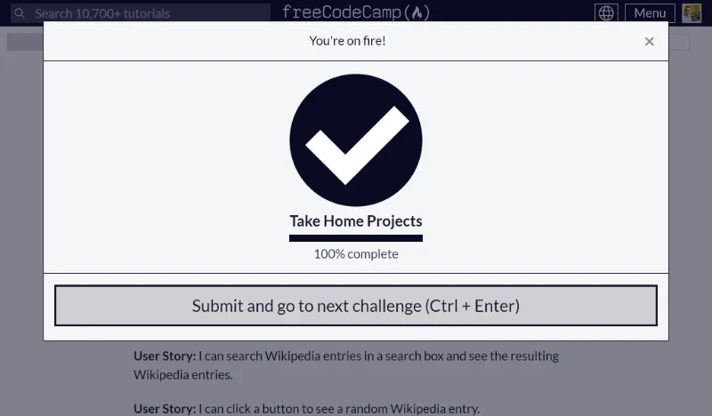

# Wikipedia Viewer

Proyecto de Freecodecamp construido en base a lo señalado en los [Requisitos del Proyecto](https://www.freecodecamp.org/learn/coding-interview-prep/take-home-projects/build-a-wikipedia-viewer).

## Tabla de Contenidos

- [Wikipedia Viewer](#wikipedia-viewer)
  - [Tabla de Contenidos](#tabla-de-contenidos)
  - [Proyecto Aprobado](#proyecto-aprobado)
  - [Screenshots](#screenshots)
    - [1-Home Page](#1-home-page)
    - [2-Búsqueda Vacía](#2-búsqueda-vacía)
    - [3-Búsqueda Exitosa](#3-búsqueda-exitosa)
    - [4-Error Handle](#4-error-handle)

## Proyecto Aprobado

## Screenshots

### 1-Home Page

### 2-Búsqueda Vacía

### 3-Búsqueda Exitosa

### 4-Error Handle

