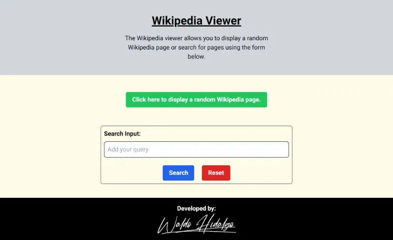
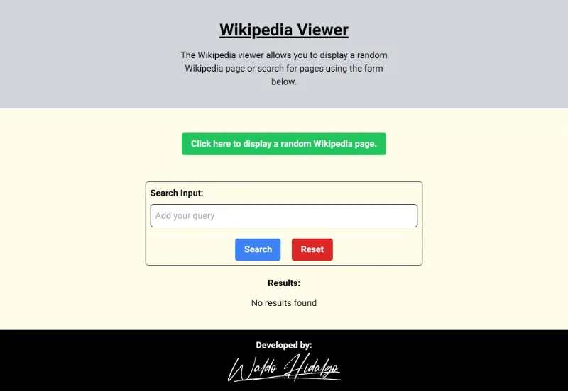
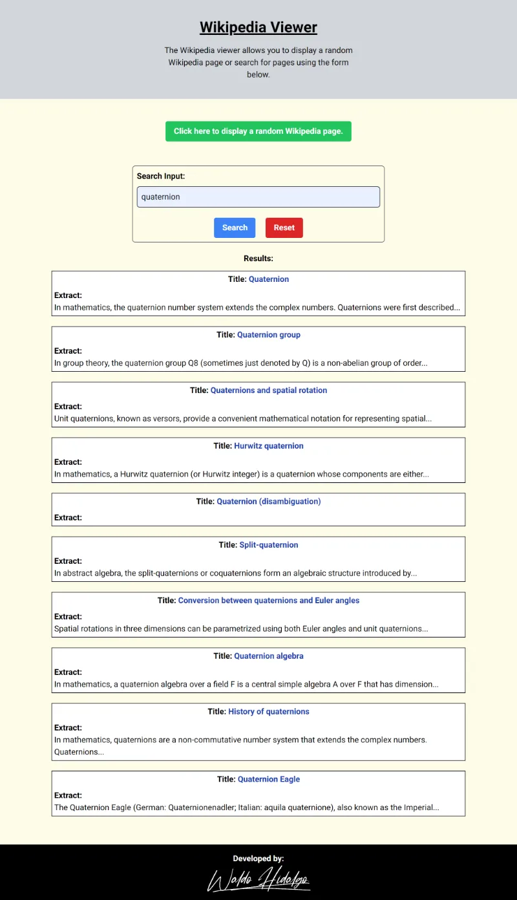
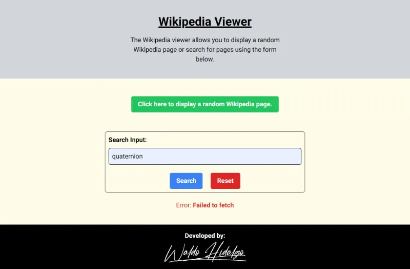

# Wikipedia Viewer

Proyecto de Freecodecamp construido en base a lo señalado en los [Requisitos del Proyecto](https://www.freecodecamp.org/learn/coding-interview-prep/take-home-projects/build-a-wikipedia-viewer).

## Proyecto Aprobado

## Screenshots

### 1-Home Page

### 2-Búsqueda Vacía

### 3-Búsqueda Exitosa

### 4-Error Handle

